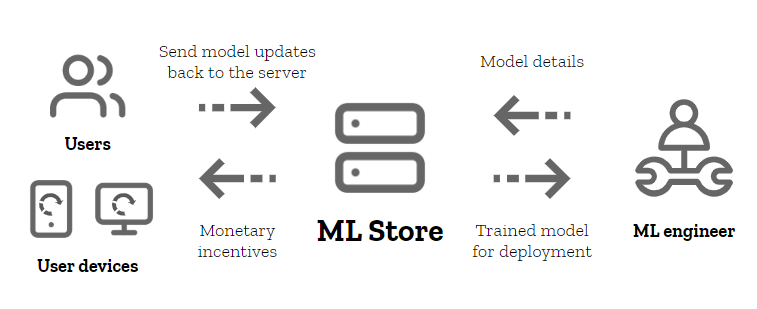
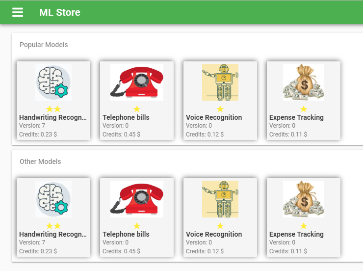
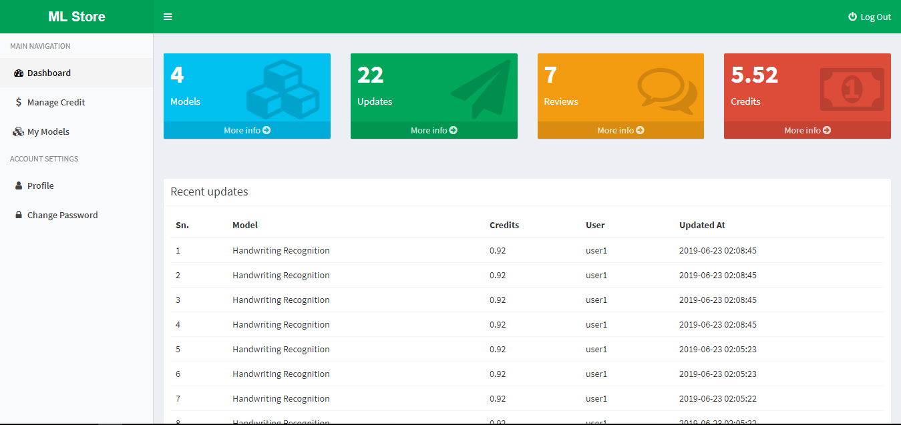
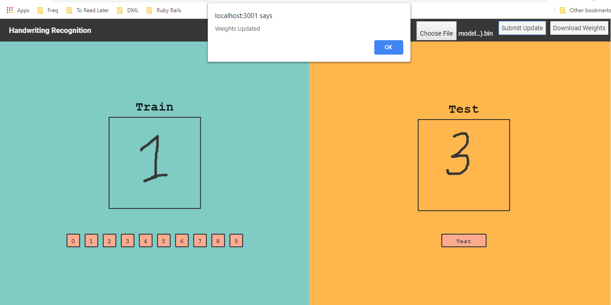

# ML-Store : Decentralized Machine Learning Platform
## BSc.CSIT Final Year Project 2019

## What is ML-Store ?

ML-Store is an attempt at implementing the concept of decentralization in the context of 
machine learning. Considering how security and sensitivity of private user data has
become a prime concern, the project aimed to utilize the concepts of federated learning and 
decentralized machine learning to find a solution to train machine learning
models that would respect those needs. To that end, this project involved making a web
platform to share and train machine learning models with on-device machine learning
without the need to upload private user data to a central server.

In this project, a machine learning engineer would upload their machine learning
models they would like to have trained. Instead of the data being provided to the model
in the server from various sources, the model itself is distributed among various
participating users in the platform. The users would voluntarily train the model in their
own devices using the data within their devices; the user in return gets incentivized for
their participation. The updates to the model is sent back to the server as new weight
values for the model. Updates from all the different users are averaged to generate a
newly trained version of the model which then can further be distributed for further
training or be used by the engineers for deployment in their own applications.

## File Structure
- /dml_backend : Laravel Server for authentication and content management
- /dml_frontend: Vuejs application to access and train models on browser
- dml_backend/fed_avg_server: NodeJS server to perform federated-aveging of updates

## Results

<table border="0">
  <tr>
    <td>
      
    </td>
    <td>
      
    </td>
   <tr>
  
  <tr>
    <td colspan="2">
      
    </td>
  </tr>
  </table>

## Team Members
  
- Bibhuti Poudyal
- Rohan Shrestha
- Roshan Chapagain

For more details, view the [project report](https://github.com/bibhuticoder/ML-Store/blob/master/doc_assets/ML-store.pdf).

